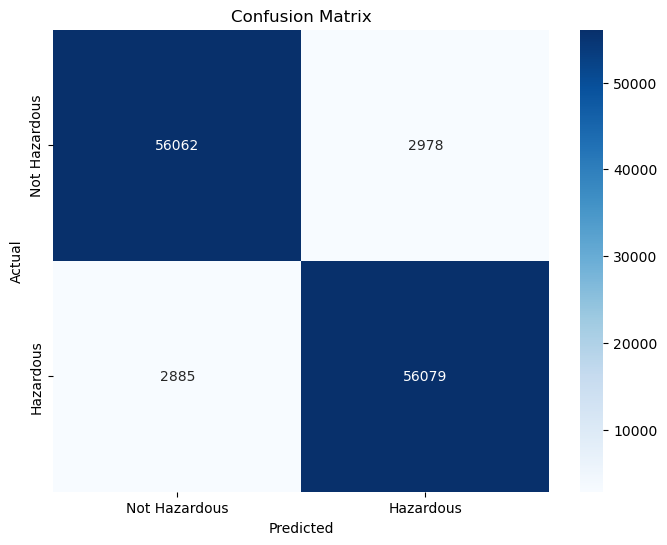
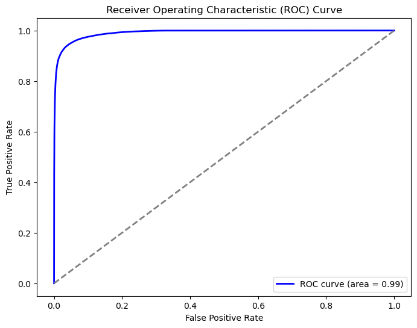
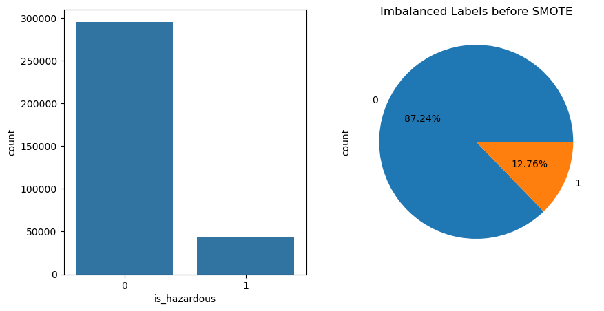
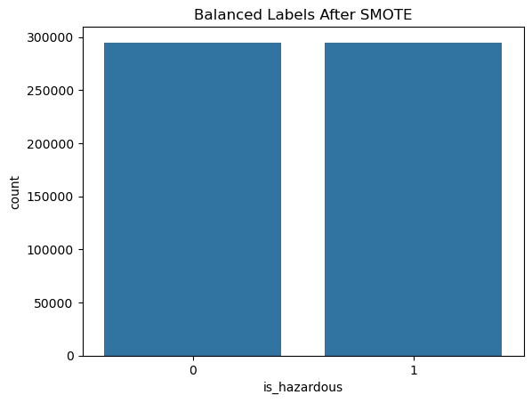

# Nearest-Earth-Objects-Classification

## **Project Overview**
This project aims to classify **Near-Earth Objects (NEOs)** as hazardous or non-hazardous based on their features. The dataset contains information about NEOs from **1910 to 2024**, including their **orbital parameters** and **hazard status**. The goal is to build a **machine learning model** to predict whether an NEO is hazardous.

---

## **📂 Dataset**
The dataset used in this project is **nearest-earth-objects(1910-2024).csv**.  
It contains the following features:

- **neo_id**: Unique identifier for the NEO.
- **name**: Name of the NEO.
- **est_diameter_min**: Minimum estimated diameter of the NEO.
- **est_diameter_max**: Maximum estimated diameter of the NEO.
- **relative_velocity**: Relative velocity of the NEO.
- **miss_distance**: Distance by which the NEO missed Earth.
- **orbiting_body**: The body the NEO is orbiting.
- **is_hazardous**: **(Target Variable)** Binary label indicating whether the NEO is hazardous (**1**) or not (**0**).

---

## **🛠 Approach**
### **1️⃣ Data Cleaning**
- Removed **missing values, duplicates**, and **irrelevant columns** (**neo_id, name, orbiting_body**).

### **2️⃣ Exploratory Data Analysis (EDA)**
- Analyzed **target variable distribution** and **feature correlations**.

### **3️⃣ Feature Selection**
- Used **SelectKBest** with the **chi-squared test** to select the **top 4 features**.

### **4️⃣ Handling Class Imbalance**
- Applied **SMOTE (Synthetic Minority Oversampling Technique)** to balance the dataset.

### **5️⃣ Model Training**
- Trained a **Random Forest Classifier** on the balanced dataset.

### **6️⃣ Model Evaluation**
- Evaluated the model using the following metrics:
  - **Accuracy**
  - **Precision**
  - **Recall**
  - **F1 Score**
  - **Balanced Accuracy**
  - **Matthews Correlation Coefficient (MCC)**
  - **ROC AUC Score**
- Visualized the **Confusion Matrix** and **ROC Curve**.

---

## **🔑 Key Findings**
- The dataset was **highly imbalanced**, with only a **small percentage** of NEOs being hazardous.
- The **top 4 features** selected by **SelectKBest** were:
  1. **est_diameter_max**
  2. **est_diameter_min**
  3. **relative_velocity**
  4. **miss_distance**

### **📊 Model Performance**
After applying **SMOTE**, the dataset was balanced, and the model achieved:

- **Accuracy**: **0.9503**
- **Precision**: **0.9496**
- **Recall**: **0.9511**
- **F1 Score**: **0.9503**
- **Balanced Accuracy**: **0.9503**
- **MCC**: **0.9006**

---

## **📈 Visualizations**
### **Confusion Matrix**
The confusion matrix provides a breakdown of the model's predictions:

- ✅ **True Positives (TP)**: Correctly predicted hazardous NEOs.
- ✅ **True Negatives (TN)**: Correctly predicted non-hazardous NEOs.
- ❌ **False Positives (FP)**: Non-hazardous NEOs incorrectly predicted as hazardous.
- ❌ **False Negatives (FN)**: Hazardous NEOs incorrectly predicted as non-hazardous.



---

### **ROC Curve**
The **ROC curve** visualizes the trade-off between the **True Positive Rate (TPR)** and **False Positive Rate (FPR)**.  
The **Area Under the Curve (AUC)** is a measure of the model's ability to distinguish between the two classes.



---

## **🎯 Target Variable Distribution**
### **Before SMOTE:**
The target variable (**is_hazardous**) was **highly imbalanced**, with most NEOs classified as non-hazardous.  
This was visualized using a **count plot** and a **pie chart**.



### **After SMOTE:**
After applying **SMOTE**, the dataset was **balanced**, with an equal number of hazardous and non-hazardous NEOs.



---

## **🚀 How to Run the Code**
To run this project locally, follow these steps:

### **1️⃣ Clone the repository**
```sh
git clone https://github.com/MalakSoula/Nearest-Earth-Objects-Classification.git
```
### **2️⃣ Navigate to the project directory**
```sh
cd Nearest-Earth-Objects-Classification
```
### **3️⃣ Open the Jupyter Notebook**
```sh
jupyter notebook nearest_earth_objects_classification.ipynb
```

# 📦 Dependencies

This project requires Python 3.x and the following libraries:

`pandas`
`numpy`
`scikit-learn`
`imblearn`
`seaborn`
`matplotlib`
